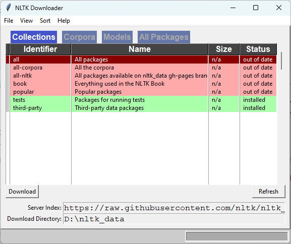
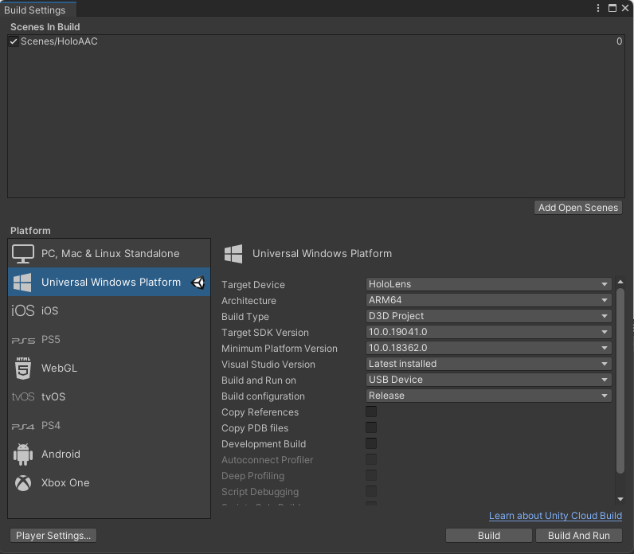
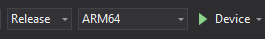
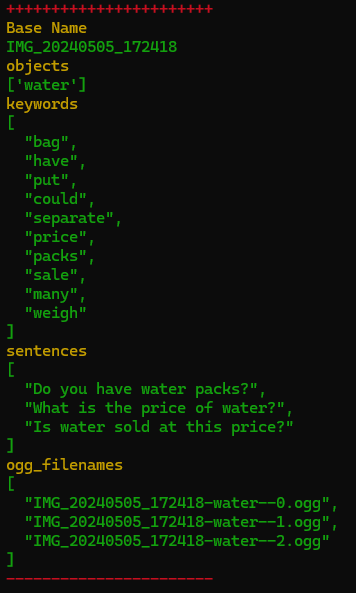

# HoloAAC: A Mixed Reality AAC Application for People with Expressive Language Difficulties

<div align="center">
<a href="https://www.chuange.org/papers/HoloAAC.html"></a>&emsp;
<a href="https://youtu.be/VL2Lulqxyhg"></a>&emsp;
<a href="https://doi.org/10.1007/978-3-031-61047-9_20"></a>&emsp;
<a href="https://www.chuange.org/files/HoloAAC.pdf"></a>&emsp;
<a href="https://www.linkedin.com/in/liuchuan-yu-64a44621a"></a>&emsp;
<a href="mailto:lyu20@gmu.edu"></a>&emsp;
<a href="#"></a>&emsp;
</div>

## Environment Setup

### Clone Project

```
git clone https://github.com/luffy-yu/HoloAAC.git
cd HoloAAC
git submodule update --init --recursive
```

### Set Up

<details>
  <summary>Python</summary>
  
  #### Development Environment
  1. Windows 11
  2. Anaconda
  3. Python 3.7.11
       * conda full dependencies file is [HoloAAC.yml](Python/HoloAAC.yml)
       * pip full dependencies files is [requirements.txt](Python/requirements.txt)
       * > They are exported by [conda-env-export](https://pypi.org/project/conda-env-export/) using the command `conda-env-export --separate --conda-all --pip-all`.
  #### Dependent Projects
  1. [PaddleSeg](https://github.com/gmudcxr/PaddleSeg.git)
  2. [yolov5](https://github.com/gmudcxr/yolov5.git)

  #### Create Conda Environment
  1. Refer to the aforementioned HoloAAC.yml file and requirements.txt to set up the environment.
  2. Installing [NLTK Data](https://www.nltk.org/data.html) via `python -c "import nltk;nltk.download()"`
     
  3. Environment validation
     * Activate the created conda environment
     * Run the following command within the folder `{project_root}/Python/HoloAAC`
  
       `python manage.py runserver 0.0.0.0:8000`
       
      > Press `Ctrl + C` to quit.
     
     * Alter the firewall settings if needed
     * If it is correctly set, it will output the following
       ```
        Watching for file changes with StatReloader
        Performing system checks...

        2024-05-05 15:16:55 [INFO]      Use GPU
        2024-05-05 15:16:57 [INFO]      Start
        2024-05-05 15:17:10 [INFO]      Finish
        YOLOv5  0965f66 torch 1.7.1+cu110 CUDA:0 (NVIDIA GeForce RTX 3070, 8192MiB)
        
        Fusing layers...
        Model Summary: 444 layers, 86334910 parameters, 0 gradients
        System check identified no issues (0 silenced).
        
        You have 18 unapplied migration(s). Your project may not work properly until you apply the migrations for app(s): admin, auth, contenttypes, sessions.
        Run 'python manage.py migrate' to apply them.
        May 05, 2024 - 15:17:21
        Django version 3.2.9, using settings 'HoloAAC.settings'
        Starting development server at http://0.0.0.0:8000/
        Quit the server with CTRL-BREAK.
        2024-05-05 15:17:28 [INFO]      Start
        2024-05-05 15:17:28 [INFO]      Finish
       ```
     * Test Making Sound
       ```
       # Run the file under `{project_root}/Python/HoloAAC/test/test_services.py`
       test_makesound()
       ```
       - It should output three ogg files under [Python/HoloAAC/sound/](Python/HoloAAC/sound/).
         > temp.png, temp-od.png, and temp-seg.png
       - It also should output three png files under [Python/HoloAAC/images/](Python/HoloAAC/images/).
         > temp-soda--0.ogg, temp-soda--1.ogg, and temp-soda--2.ogg
     * Test Making Sentences
       ```
       # Run the file under `{project_root}/Python/HoloAAC/test/test_services.py`
       test_makesentences()
       ```
       - It should output three ogg files under [Python/HoloAAC/sound/](Python/HoloAAC/sound/).
         - 1ee14688-61d2-11ec-95a6-9e64c55a142e-water--0.ogg
         - 1ee14688-61d2-11ec-95a6-9e64c55a142e-water--1.ogg
         - 1ee14688-61d2-11ec-95a6-9e64c55a142e-water--2.ogg
     
     * **Log also will be printed out on the command (terminal) window.**
</details>

<details>
  <summary>Unity </summary>

  #### Development Environment
  1. Windows 11
  2. Unity 2020.3.20
  3. Microsoft Visual Studio Community 2019
    
  #### Build Settings

  

  #### Build
  * Build
  * Open with VS 2019
  * Set **Release**, **ARM64**, **Device**.

   

  * Build Solution
  * Deploy Solution

</details>

### Run

1. Ensure PC and HoloLens 2 are network reachable.
2. Run the Python client on PC

  > python manage.py runserver 0.0.0.0:8000

<details>
  <summary>3. Run HoloAAC on HoloLens 2</summary>

   * Open it
   * Click the left bottom **Network** button
   * Set up the server ip and port
   * Click **Test**
     * If `status` becomes OK, it means network is reachable.
     * If `status` becomes FAIL, it means network is NOT reachable. **Fix the network issue before continuing.**
      
     > This setting can be also found or set through the Windows Device Portal. 
There is a file **host.ip** under `User Folders\LocalAppData\HoloAAC_1.0.0.0_arm64__xxxx\LocalState\`.
Its content is the ip and port, e.g., 192.168.0.221:8000. It will load this file when HoloAAC starts.
Therefore, as long as network doesn't change, there is no need to test or update the server information.
   * Click **Confirm** to close this window
   * Click **Camera** button to take picture
   * Captured images and sound files in ogg format will be saved to `User Folders\LocalAppData\HoloAAC_1.0.0.0_arm64__xxxx\LocalState\`.
     * There is also a log file saved here. For example, the following shows the content of file `data_20240505.txt`.
     ```text
     2024-05-05 18:00:23,OPEN,
     2024-05-05 18:08:54,CLICK_IGN,
     2024-05-05 18:08:54,REQUEST,
     2024-05-05 18:09:15,TIME_COST,21132ms
     2024-05-05 18:09:16,CLICK_IGN,
     2024-05-05 18:09:16,REQUEST,
     2024-05-05 18:09:38,TIME_COST,21081ms
     2024-05-05 18:10:50,OPEN,
     2024-05-05 18:12:11,CLICK_CAM,
     2024-05-05 18:12:17,IMG_SAVE,IMG_20240505_181215.jpg
     2024-05-05 18:12:17,REQUEST,
     2024-05-05 18:12:20,IMAGE_RES,
     2024-05-05 18:12:20,TIME_COST,2685ms
     2024-05-05 18:12:23,CLICK_STS,Can you put the water and chocolate in one bag?
     2024-05-05 18:12:56,CLOSE,
     ```
   * Captured processed images will be saved to `Python/HoloAAC/images/`.
   * Synthesized sound files in ogg format will be saved to `Python/HoloAAC/sound/`.
   * Additional information such as network requests will be shown on the terminal window.
     * 

</details>

### Citation

**If you find this work useful, please cite it using the following format.**

```
@inproceedings{yu2024holoaac,
  title={HoloAAC: A Mixed Reality AAC Application for People with Expressive Language Difficulties},
  author={Yu, Liuchuan and Feng, Huining and Alghofaili, Rawan and Byun, Boyoung and O'Neal, Tiffany and Rampalli, Swati and Chung, Yoosun and Motti, Vivian Genaro and Yu, Lap-Fai},
  booktitle={International Conference on Human-Computer Interaction},
  year={2024},
  organization={Springer}
}
```
